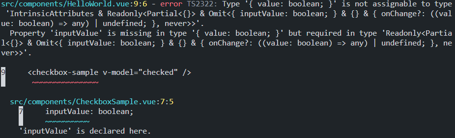
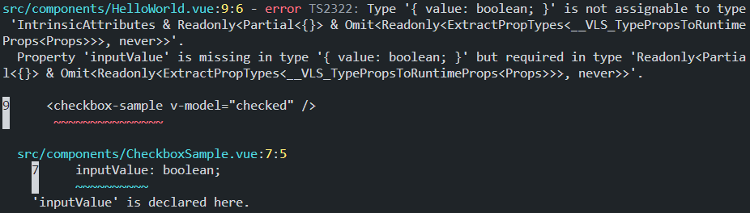

# vue 2 (&amp; model) + volar -> error sample

## problem

`script setup` + `vue2` + `export default { model }` + `vue-tsc` not supoort.

* add props and emits

```ts
type Props = {
    inputValue: boolean;
};
const props = defineProps<Props>();
const emits = defineEmits<{
    (name:"change", value:boolean):void
}>()
```

* add export default model

```ts
export default {
    model: {
        prop: "inputValue",
        event: "change",
    },
}
```

* use v-model

```vue
<checkbox-sample v-model="checked" />
```

## error

* vue 2.6



* vue 2.7



## conclusion

→ vue2 + volar is alternate v-model is not support (v-bind:value and v-on:input only support. (vue2
